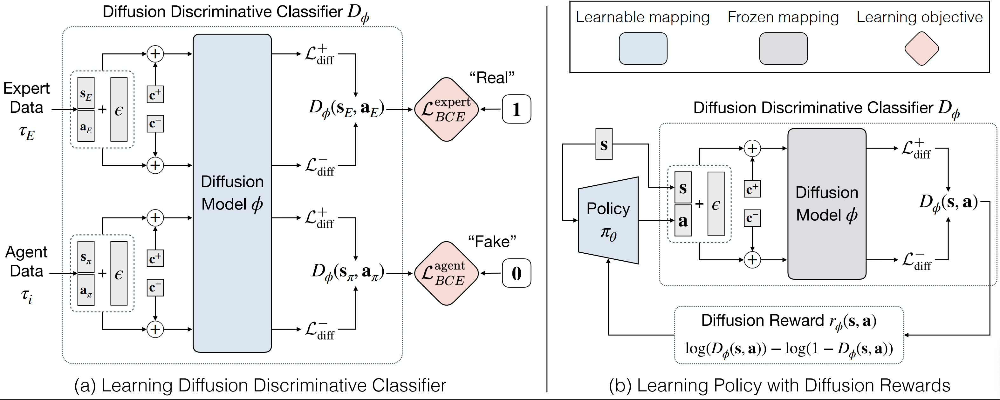

# Diffusion Rewards Adversarial Imitation Learning (DRAIL)

<h1 align="center"> 
    
</h1>

The Official PyTorch implementation of [**Diffusion Rewards Adversarial Imitation Learning**](https://arxiv.org/abs/2405.16194).

[Chun-Mao Lai\*](https://www.mecoli.net/)<sup>1</sup>,
[Hsiang-Chun Wang\*](https://hsiangchun0205.github.io/)<sup>1</sup>,
[Ping-Chun Hsieh](https://pinghsieh.github.io/)<sup>2</sup>,
[Yu-Chiang Frank Wang](https://vllab.ee.ntu.edu.tw/ycwang.html)<sup>1,3</sup>,
[Min-Hung Chen](https://minhungchen.netlify.app/)<sup>3</sup>,
[Shao-Hua Sun](https://shaohua0116.github.io)<sup>1</sup><br>
<sup>1</sup>[NTU RobotLearning Lab](https://shaohua0116.github.io/), <sup>2</sup>National Yang Ming Chiao Tung University, <sup>3</sup>[NVIDIA Research Taiwan](https://research.nvidia.com/labs/twn/)<br>
(\*Equal contribution)

[[`Paper`](https://arxiv.org/abs/2405.16194)] [[`Website`](https://nturobotlearninglab.github.io/DRAIL/)] [[`BibTeX`](#citation)] [[`ICLRW'24 Poster`](./drail_poster.png)]

This work proposes **Diffusion-Reward Adversarial Imitation Learning (DRAIL)**, which integrates a diffusion model into GAIL, aiming to yield more precise and smoother rewards for policy learning. Specifically, we propose a diffusion discriminative classifier to construct an enhanced discriminator; then, we design diffusion rewards based on the classifier's output for policy learning. We conduct extensive experiments in navigation, manipulation, and locomotion, verifying DRAIL's effectiveness compared to prior imitation learning methods. Moreover, additional experimental results demonstrate the generalizability and data efficiency of DRAIL. Visualized learned reward functions of GAIL and DRAIL suggest that DRAIL can produce more precise and smoother rewards.

For business inquiries, please visit our website and submit the form: [NVIDIA Research Licensing](https://www.nvidia.com/en-us/research/inquiries/).

## Installation

### Preliminaries

- [pytorch](https://pytorch.org/get-started/locally/)
- [mujoco-py](https://github.com/openai/mujoco-py?tab=readme-ov-file#install-mujoco)

### Environment Setup

1. This code base requires `Python 3.8` or higher. All package requirements are in
   `requirements.txt`. To install from scratch using Anaconda, use the following
   commands.
   ```   
   conda create -n [your_env_name] python=3.8
   conda activate [your_env_name]
   ./utils/setup.sh
   ```

2. Setup [Weights and Biases](https://wandb.ai/site) by first logging in with `wandb login <YOUR_API_KEY>` and then editing `config.yaml` with your W&B username and project name.

### Expert Demonstration Setup

1. Download expert demonstration datasets to `./expert_datasets`. Most of the expert demonstration datasets we used are provided by [goal_prox_il](https://github.com/clvrai/goal_prox_il). We provide a script for downloading and post-processing the expert datasets.

   ```
   ./utils/expert_data.sh
   ```

2. For the ‘Walker’ task, we provide a script to generate expert demonstrations with fewer trajectories. Please check out [Walker/Expert Data](#walker) to obtain it and place it under `./expert_datasets`. Execute the following command to post-process the expert data:
   ```
   ./utils/clip_walker.py
   ```

## How to reproduce experiments

To replicate the experiments conducted in our paper, follow these steps:

1. **Select Configuration Files:** The wandb sweep configuration files for all tasks can be found in the `configs` directory. Inside each lowest-level directory (e.g., `./configs/push/1.50/2000`, `./configs/walker/5traj`, etc.), you'll find six common files:
   - `drail.yaml`
   - `drail-un.yaml`
   - `gail.yaml`
   - `wail.yaml`
   - `bc.yaml`
   - `diffusion-policy.yaml`
2. **Run Experiments:** After selecting the desired configuration file, execute the following command:
   ```
   ./utils/wandb.sh <Path_to_Configuration_File.yaml>
   ```

Below are detailed descriptions of each task:

### Maze

- **Path:** `./configs/maze`
- **Expert Coverages:** The `./configs/maze` directory contains subdirectories names after different expert coverages, including `100`, `75`, `50`, and `25`. Each folder represents a specific expert coverage configuration.

### FetchPick

- **Path:** `./configs/pick`
- **Noise Levels:** The `./configs/pick` directory contains subdirectories named after different noise levels, including `1.00`, `1.25`, `1.50`, `1.75`, and `2.00`. Each folder represents a specific noise level configuration.

### FetchPush

- **Path:** `./configs/push`
- **Noise Levels:** The `./configs/push` directory contains subdirectories named after different noise levels, including `1.00`, `1.25`, `1.50`, `1.75`, and `2.00`. Each folder represents a specific noise level configuration.
- **Expert Transitions:** Within the `./configs/push/1.50` directory, there are four additional subdirectories: `2000`, `5000`, `10000`, and `20311`. These numbers denote the number of expert transitions available for this setting. For other noise levels, the default number of expert transitions is 20311.

### HandRotate

- **Path:** `./configs/hand`
- **Noise Levels:** The `./configs/hand` directory contains subdirectories named after different noise levels, including `1.00`, `1.25`, `1.50`, `1.75`, and `2.00`. Each folder represents a specific noise level configuration.

### AntGoal

- **Path:** `./configs/ant`
- **Noise Levels:** The `./configs/ant` directory contains subdirectories named after different noise levels, including `0.00`, `0.01`, `0.03`, and `0.05`. Each folder represents a specific noise level configuration.

### Walker

- **Path:** `./configs/walker`
- **Expert Trajectories:** The `./configs/walker` directory contains subdirectories named after different number of expert trajectories, including `25traj`, `5traj`, `3traj`, `2traj`, and `1traj`.
- **Expert Data:** To obtain the expert data, follow these steps using the provided code and configuration under the `./configs/walker/expert` directory in this section:
  - Utilize the provided configuration file `ppo.yaml` to train a PPO model (default name: `ppo_walker_expert_model.pt`) and put it into the `expert_datasets` directory.
  - Modify the `--load-file` argument in the `collect_trajs.sh` script to point to the path of your trained model (typically located in `./data/trained_models/Walker2d-v3/...`).
  - Execute the following command:
    ```
    ./configs/walker/expert/collect_trajs.sh
    ```
  - The expert data will be stored in `./data/traj/Walker2d-v3/...`.

<!-- ### HalfCheetah

- **Path:** `./configs/halfcheetah`
- **Expert Trajectories:** The `./configs/halfcheetah` directory contains subdirectories named after different number of expert trajectories, including `5traj`, `3traj`, `2traj`, and `1traj`.
- **Expert Data:** To obtain the expert data, follow these steps using the provided code and configuration under the `./configs/halfcheetah/expert` directory in this section:
  - Utilize the provided configuration file `ppo.yaml` to train a PPO model (default name: `ppo_halfcheetah_expert_model.pt`) and put it into the `expert_datasets` directory.
  - Modify the `--load-file` argument in the `collect_trajs.sh` script to point to the path of your trained model (typically located in `./data/trained_models/HalfCheetah-v3/...`).
  - Execute the following command:
    ```
    ./configs/halfcheetah/expert/collect_trajs.sh
    ```
  - The expert data will be stored in `./data/traj/HalfCheetah-v3/...`. -->

## Code Structure

- `drail`: Implementation of our main method.
  - `drail/drail.py`: Code for our method **DRAIL**.
  - `drail/drail_un.py`: Code for the variant of our method **DRAIL-UN**.
  - `drail/ddpm`: Directory containing the diffusion model.
    - `drail/ddpm/ddpm_condition.py`: Code for the diffusion model of **DRAIL**.
    - `drail/ddpm/ddpm_condition.py`: Code for the diffusion model of **DRAIL-UN**.
    - `drail/ddpm/policy_model.py`: Code for the diffusion model of **Diffusion Policy**.
- `utils`: Useful scripts.
  - `utils/clip_halfcheetah.py`: Generate the Halfcheetah expert data with fewer trajectories.
  - `utils/clip_walker.py`: Generate the Walker expert data with fewer trajectories.
  - `utils/clip_push.py`: Generate the FetchPush expert data with fewer transitions.
  - `utils/wandb.sh`: Script to automatically create and execute wandb command from a configuration file.
  - `utils/setup.sh`: Script to install and set up the conda environment.
  - `utils/expert_data.sh`: Script to download and postprocess the expert demonstrations.
- `shape_env`: Customized environment code.
  - `shape_env/rollout_sine2000.py`: Code to generate the `Sine` function expert transitions.
- `goal_prox`: Customized environment code from [goal_prox_il](https://github.com/clvrai/goal_prox_il).
  - `goal_prox/envs/ant.py`: AntGoal locomotion task.
  - `goal_prox/envs/fetch/custom_fetch.py`: FetchPick task.
  - `goal_prox/envs/fetch/custom_push.py`: FetchPush task.
  - `goal_prox/envs/hand/manipulate.py`: HandRotate task.
  - `goal_prox/gym_minigrid`: MiniGrid code for navigation environment from [maximecb](https://github.com/maximecb/gym-minigrid).
- `rl-toolkit`: Base RL code and code for imitation learning baselines from [rl-toolkit](https://github.com/ASzot/rl-toolkit).
  - `rl-toolkit/rlf/algos/on_policy/ppo.py`: PPO policy updater code used for RL.
  - `rl-toolkit/rlf/algos/il/gail.py`: Baseline Generative Adversarial Imitation Learning (**GAIL**) code.
  - `rl-toolkit/rlf/algos/il/wail.py`: Baseline Wasserstein Adversarial Imitation Learning (**WAIL**) code.
  - `rl-toolkit/rlf/algos/il/bc.py`: Baseline Behavioral Cloning (**BC**) code.
  - `rl-toolkit/rlf/algos/il/dp.py`: Baseline **Diffusion Policy** code.
- `d4rl`: Codebase from [D4RL: Datasets for Deep Data-Driven Reinforcement Learning](https://github.com/rail-berkeley/d4rl) for Maze2D.

## Acknowledgement

### Code

- The base code was adapted from [goal_prox_il](https://github.com/clvrai/goal_prox_il).
- The Grid world environment was obtained from [maximecb](https://github.com/maximecb/gym-minigrid)
- The Fetch and Hand Rotate environments were customized based on [OpenAI](https://github.com/openai/robogym) implementations.
- The Ant environment was customized by [goal_prox_il](https://github.com/clvrai/goal_prox_il) and originated from [Farama-Foundation](https://github.com/Farama-Foundation/Gymnasium).
- The SAC code was obtained from [denisyarats](https://github.com/denisyarats/pytorch_sac)
- The Maze2D environment is based on [D4RL: Datasets for Deep Data-Driven Reinforcement Learning](https://github.com/rail-berkeley/d4rl).

### Expert Dataset

- The expert demonstrations of the Maze, FetchPick, FetchPush, HandRotate, and AntReach tasks were obtained from [goal_prox_il](https://github.com/clvrai/goal_prox_il).

## Citation

If you find DRAIL useful, please consider giving a star and citation:

```bibtex
@article{lai2024diffusion,
  title={Diffusion-Reward Adversarial Imitation Learning},
  author={Lai, Chun-Mao and Wang, Hsiang-Chun and Hsieh, Ping-Chun and Wang, Yu-Chiang Frank and Chen, Min-Hung and Sun, Shao-Hua},
  journal={arXiv preprint arXiv:2405.16194},
  year={2024}
}
```

## Licenses

Copyright © 2024, NVIDIA Corporation. All rights reserved.

This work is made available under the NVIDIA Source Code License-NC. Click [here](LICENSE) to view a copy of this license.
